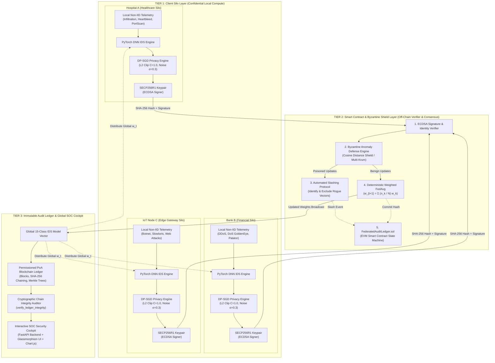
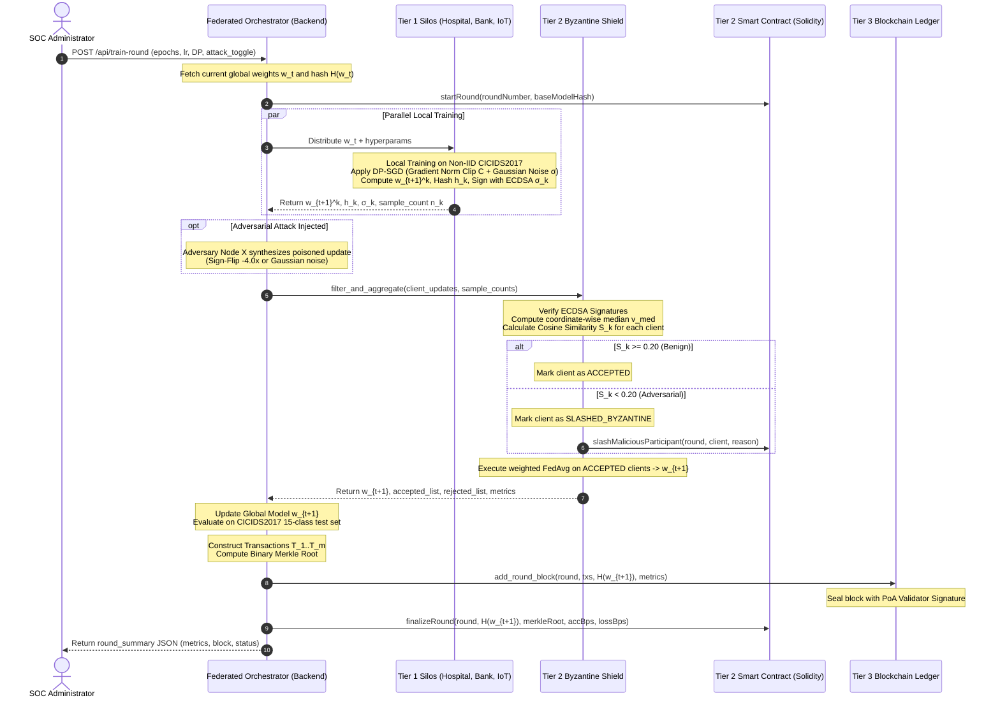
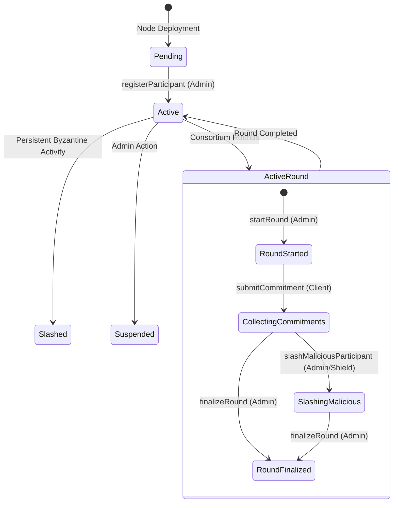

# System Architecture Specification

## Project: Blockchain-Enabled Federated AI Framework for Secure Distributed Intelligence
**Document Version:** 1.0.0  
**Target Solution:** Clone & Clean-Room Reproduction Specification  
**Architecture Paradigm:** Three-Tier Decentralized Hybrid On-Chain / Off-Chain Architecture  

---

### 1. High-Level Architectural Topology

The framework is structured as a **Three-Tier Architecture** that cleanly separates local confidential computation, decentralized consensus and Byzantine anomaly filtering, and immutable cryptographic record-keeping.



---

### 2. The Three-Tier Architectural Layers

#### 2.1 Tier 1: Client Silo Layer (Confidential Local Compute)
Tier 1 represents the isolated, autonomous enterprise organizations participating in the threat intelligence consortium. Each participant:
- Operates inside its private network boundary (on-premise datacenter or private VPC).
- Maintains local, Non-IID network flow data extracted from network interfaces or firewalls.
- Instantiates a local replica of the `IntrusionDetectionDNN`.
- Trains for $E$ local epochs using Adam/SGD optimizer.
- Applies **DP-SGD** to clip the $L_2$ gradient norm to threshold $C$ and inject calibrated Gaussian noise before the optimizer steps.
- Serializes the updated model parameters into a flat 1D vector and calculates the SHA-256 fingerprint $h_k = \text{SHA-256}(\mathbf{w}_k)$.
- Digitally signs $h_k$ using its private key: $\sigma_k = \text{Sign}_{sk_k}(h_k)$.
- Transmits only the updated weights $\mathbf{w}_k$, fingerprint $h_k$, sample count $n_k$, and signature $\sigma_k$ to Tier 2. **Raw telemetry never leaves Tier 1.**

#### 2.2 Tier 2: Smart Contract & Byzantine Shield Layer (Verification & Aggregation)
Tier 2 acts as the decentralized gatekeeper and consensus aggregation engine:
1. **Cryptographic Identity Verification**: Validates $\sigma_k$ using the participant's registered public key $pk_k$. Rejects unauthenticated or forged submissions.
2. **Consensus Alignment & Byzantine Shield**:
   - Calculates the coordinate-wise median vector $\mathbf{v}_{\text{median}}$ across all submitted updates.
   - Evaluates directional alignment via Cosine Similarity:
     $$\mathcal{S}_k = \frac{\mathbf{w}_k \cdot \mathbf{v}_{\text{median}}}{\|\mathbf{w}_k\|_2 \|\mathbf{v}_{\text{median}}\|_2}$$
   - Compares $\mathcal{S}_k$ against threshold $\tau$ (default 0.20).
   - If $\mathcal{S}_k < \tau$, the node is flagged as a Byzantine adversary (sign-flipping, Gaussian noise, or backdoor poisoning).
3. **Slashing & Exclusion Protocol**: Slashes malicious nodes, logs a `ByzantineClientSlashed` event on-chain, and excludes the candidate from the aggregation pool.
4. **Deterministic Weighted FedAvg**: Executes aggregation strictly on verified benign updates:
   $$\mathbf{w}_{t+1} = \sum_{k \in \text{Accepted}} \frac{n_k}{\sum_{j \in \text{Accepted}} n_j} \mathbf{w}_k$$
5. **Smart Contract Synchronization**: Submits commitment receipts, Merkle root, and model hashes to `FederatedAuditLedger.sol`.

#### 2.3 Tier 3: Ledger & Global SOC Dashboard Layer (Audit & Intelligence)
Tier 3 provides immutable persistence, forensic accountability, and real-time visualization:
1. **Blockchain Block Assembly**:
   - Compiles round transactions $\{T_1, \dots, T_m\}$ (containing client ID, weight hash, status, anomaly score, sample count).
   - Builds a Binary Merkle Tree of transaction hashes and extracts the `merkle_root`.
   - Links the block to the previous block hash ($H_{\text{prev}}$).
   - Records the updated global model SHA-256 hash and evaluation metrics (accuracy, loss, F1, precision, recall).
   - Sealing the block using the consortium validator's SECP256R1 key.
2. **Real-Time Cryptographic Auditor**: Traverses the chain from genesis to the current block, validating block hashes, previous pointers, Merkle trees, and validator signatures.
3. **SOC Cockpit**: High-tech web dashboard serving real-time Chart.js convergence curves, client status cards, block explorer, and one-click JSON compliance export.

---

### 3. Detailed Communication & Training Sequence



---

### 4. Cryptographic & Mathematical Security Architecture

#### 4.1 Asymmetric Key Management & Digital Signatures
- **Curve**: `SECP256R1` (NIST P-256) ECDSA.
- **Key Generation**: 256-bit private keys generated via secure entropy (`ec.generate_private_key(ec.SECP256R1())`).
- **Public Key Serialization**: Standard X.509 SubjectPublicKeyInfo in PEM format, serialized as hex string for smart contract registration and HTTP payload transmission.
- **Signing Standard**: ECDSA over SHA-256 hash digest:
  $$\sigma = \text{Sign}_{sk}(\text{SHA-256}(m))$$
- **Verification**: Signature verification strictly enforces DER-encoded ECDSA signature verification against the sender's public key.

#### 4.2 Deterministic Weight Fingerprinting
To guarantee that two independent entities computing the hash of the same neural network weights produce an identical SHA-256 digest:
1. All PyTorch model parameters are cast to standard IEEE 754 32-bit floating point (`np.float32`).
2. Parameters are flattened into a contiguous 1D array in deterministic layer order:
   `[net.0.weight, net.0.bias, net.1.weight, net.1.bias, ..., net.9.weight, net.9.bias]`
3. Raw byte stream `arr_bytes = weights.astype(np.float32).tobytes()` is fed into SHA-256:
   $$H(\mathbf{w}) = \text{SHA-256}(\text{tobytes}(\mathbf{w}))$$

#### 4.3 Binary Merkle Tree Construction
For a set of $m$ transaction hashes $\{T_1, T_2, \dots, T_m\}$:
1. If $m = 0$: $\text{MerkleRoot} = \text{SHA-256}(\text{"empty\_tree"})$.
2. If $m = 1$: $\text{MerkleRoot} = T_1$.
3. For $m > 1$, iteratively pair adjacent leaves:
   $$\text{Parent}_{j} = \text{SHA-256}(\text{Left}_{2j} \parallel \text{Right}_{2j+1})$$
4. If the number of nodes at the current level is odd, the last leaf is duplicated ($\text{Right} = \text{Left}$).
5. The algorithm repeats until exactly one 32-byte root hash remains.

```
                  [ Merkle Root ]
                     /        \
          [ Hash 0-1 ]        [ Hash 2-3 ]
            /      \            /      \
        [ Tx 0 ] [ Tx 1 ]   [ Tx 2 ] [ Tx 3 ]
```

#### 4.4 Differential Privacy via DP-SGD
Local training enforces mathematical $(\epsilon, \delta)$-differential privacy against gradient inversion and membership inference attacks:
1. **$L_2$ Gradient Norm Clipping**:
   $$\bar{\mathbf{g}} = \mathbf{g} \cdot \min\left(1, \frac{C}{\|\mathbf{g}\|_2}\right)$$
   Where $C$ is the clipping threshold (default $C = 1.0$).
2. **Calibrated Gaussian Noise Addition**:
   $$\tilde{\mathbf{g}} = \bar{\mathbf{g}} + \mathcal{N}\left(0, \frac{\sigma^2 C^2}{B} \mathbf{I}\right)$$
   Where $\sigma$ is the noise multiplier and $B$ is the mini-batch size.
3. **Advanced Composition Privacy Accounting**:
   The cumulative privacy budget spent after $T$ steps with subsampling ratio $q = \frac{B}{N}$ is bounded by:
   $$\epsilon \approx \frac{q \sqrt{2 T \ln(1/\delta)}}{\sigma} + \frac{q^2 T}{2 \sigma^2}$$

#### 4.5 Byzantine Anomaly Defense Algorithms
The framework provides three pluggable Byzantine defense filters:

```
Method 1: Cosine Distance Shield (Consensus Alignment)
- Compute median coordinate vector: v_med = median(w_1, ..., w_K)
- For each client k:
    cos_sim_k = (w_k · v_med) / (||w_k|| · ||v_med||)
- Accept if cos_sim_k >= 0.20, Reject/Slash if cos_sim_k < 0.20

Method 2: Multi-Krum
- Calculate pairwise Euclidean distance matrix D[i, j] = ||w_i - w_j||^2
- For each client i, sort distances and compute Krum score:
    Score_i = sum(k_nearest_distances)
- Select (m - f) clients with lowest scores (closest to cluster center)

Method 3: Coordinate-wise Median / Trimmed Mean
- Aggregate parameters coordinate-by-coordinate:
    w_aggregated[j] = median(w_1[j], w_2[j], ..., w_K[j])
```

---

### 5. Hybrid On-Chain / Off-Chain Architecture (Solving BAFFLE)

A major hurdle identified in academic literature (Ramanan et al. [BAFFLE]) is the prohibitive gas cost of executing machine learning math directly inside EVM smart contracts.

| Dimension | Pure On-Chain FL (BAFFLE) | Centralized FL (Standard FedAvg) | Our Hybrid Architecture |
|---|---|---|---|
| **Weight Computation** | On-Chain EVM (millions of gas) | Central Server (fast, but SPoF) | **Off-Chain Trusted Nodes (Fast, Native NumPy/PyTorch)** |
| **Integrity Proofs** | None (weights in clear storage) | None (black-box coordinator) | **On-Chain Cryptographic SHA-256 & Merkle Roots** |
| **Sybil & Access Control** | Smart Contract | Unauthenticated API | **SECP256R1 Public Keys & On-Chain Participant Registry** |
| **Byzantine Slashing** | High-gas on-chain distance math | Central server subjective drop | **Off-Chain Shield + On-Chain Slashing Receipts & Events** |
| **EVM Gas Cost** | Exceeds block gas limit ($> 30\text{M}$ gas) | Zero (no blockchain) | **Constant $O(1)$ Gas per Round (~85k gas)** |

#### Smart Contract State Machine (`contracts/FederatedAuditLedger.sol`)



---

### 6. Backend API Gateway & Server Architecture

The server component (`server/app.py`) is built using **FastAPI** and **Uvicorn**:
- **Application Class**: `fastapi.FastAPI` with asynchronous request handling.
- **Middleware**: `fastapi.middleware.cors.CORSMiddleware` configured with wildcard origins for local development flexibility.
- **Concurrency Model**: CPU-bound federated training rounds run synchronously inside the request handler or worker thread pool, preventing thread starvation.
- **Static Asset Serving**: Serves the single-page application from `frontend/` mounted at `/static` and `/`.
- **Error Handling**: Graceful `HTTPException` propagation with status codes 400 (tamper prerequisite failure) and 500 (internal execution failure).

---

### 7. Frontend UI Architecture

The frontend (`frontend/`) is a zero-dependency, ultra-fast single page application:
- **Structure (`index.html`)**: Semantic HTML5 markup divided into Architecture Banner, Execution Cockpit, Metrics Grid, Convergence Charts, Block Explorer, and Tamper Auditor.
- **Styling (`styles.css`)**: Vanilla CSS3 utilizing:
  - Custom CSS variables for theme tokens (`--bg-primary: #0a0e17`, `--accent-cyan: #00f2fe`, `--accent-emerald: #10b981`).
  - Dark-mode glassmorphism cards (`backdrop-filter: blur(16px)`, `background: rgba(16, 24, 40, 0.6)`).
  - Ambient radial background glow spheres (`glow-1`, `glow-2`).
- **Logic & Charting (`app.js`)**:
  - Pure JavaScript (ES6+ async/await, DOM queries).
  - **Chart.js** integration with dual y-axes for Accuracy (%) and Loss curves.
  - Interactive block inspector modal rendering full transaction JSON and Merkle proofs.
  - Real-time SSE / REST polling status updates.

---

### 8. Threat Modeling & Defense Matrix

| Attack Vector | Attacker Objective | System Vulnerability in Traditional FL | Mitigation in Our Framework |
|---|---|---|---|
| **Sign-Flipping Poisoning** | Reverse gradient updates to destroy IDS detection accuracy. | Standard FedAvg blindly sums all updates. | **Cosine Distance Shield**: Identifies negative directional alignment ($\mathcal{S}_k < 0.20$), slashes node, and excludes it. |
| **Gaussian Noise Flood** | Inject random high-variance noise to cause model divergence. | Averaged noise degrades convergence speed. | **Multi-Krum & Cosine Shield**: Outlier Euclidean distances / orthogonal directions are isolated and pruned. |
| **Backdoor Injection** | Perturb weights to create blind spots for specific attacks (e.g., Botnet). | No provenance or attribution of weights. | **On-Chain Audit Trail + Slashing**: Identifies anomalous localized layer shifts; permanent audit record enables post-mortem forensics. |
| **Sybil Node Attack** | Spawn fake client identities to outvote benign nodes. | Unauthenticated client onboarding. | **SECP256R1 Public Key Registry**: Smart contract restricts round submissions strictly to registered, active consortium nodes. |
| **Gradient Inversion Attack** | Reconstruct training network packets from gradient updates. | Gradients shared in cleartext reveal raw features. | **DP-SGD**: Gradient norm clipping and calibrated Gaussian noise injection provably destroy per-sample reconstruction capability. |
| **Ledger Tampering / History Rewrite** | Alter past training blocks or delete slashing evidence. | Centralized database can be edited by rogue DB admin. | **SHA-256 Block Chaining & Merkle Roots**: Any modified byte breaks the cryptographic hash pointer, triggering immediate red-alert detection. |
